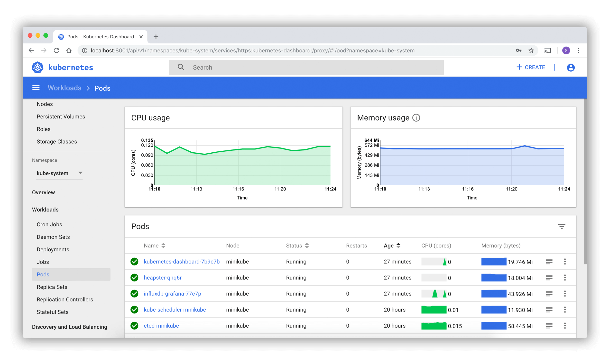

# Kubernetes Dashboard Manager

This script is created for managing (install, uninstall, run and test) official Kubernetes Dashboard WebApp.

Based on official Kubernetes Dashboard repository and installed with Helm (access by SSL and localhost)'

more info : https://kubernetes.io/docs/tasks/access-application-cluster/web-ui-dashboard/'

## Requirements

[kubectl](https://kubernetes.io/fr/docs/tasks/tools/install-kubectl/)

[helm](https://helm.sh/docs/intro/install/)

## details

Standard process for installing dashboard contains more than 4 manual actions.

Remove dashboard without reset your Kubernetes Cluster is not provided by this standard process.

If you want test and learn Kubernetes in a visual way without headache about install this dashboard.

The script is based on Bash language programming.

This repository contains those 2 officials deployments added for running dashboard in well.

Be patient during installation of Helm Chart...
